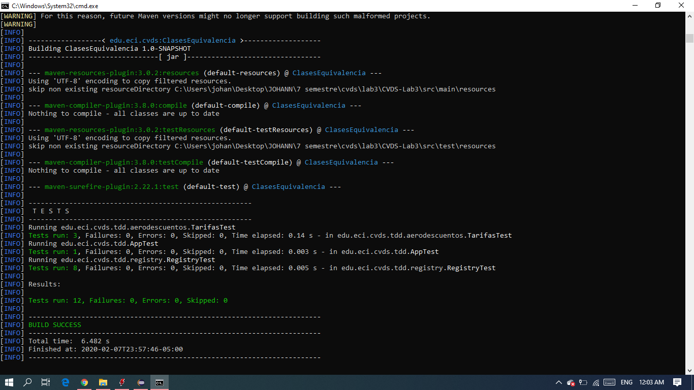

# Lab 3
**Integrantes:**
1. **Johan Guerrero**
2. **Johann Bogota**

## Ejercicio Registraduría
**clases de equivalencia**
- La edad de la persona tiene que ser valida es decir mayor a 18 años
		casos de prueba: edad=17,18,19,2,30,-12
- La persona ha de estar viva
		casos de prueba: viva, muerta
- No puede haber numeros duplicados
		casos de prueba: Persona1 num:154832,Persona2 num:154832 
- El nombre de la persona contenga numeros
		casos de prueba: Juan4563, Johan Guerrero
- el numero de digitos de la identificacion debe estar en un rango de 8 a 10
		casos de prueba: 100032927,23,2157826,10224472,1548788888

## Ejercicio "Descuento de tarifas"
**Especificación**
~~~
	/**
	calcular la tarifa de cada billete según el trayecto, la antelación
	en la que se obtiene el billete y la edad del pasajero, de acuerdo
	con la normativa 005.
	@param tarifaBase valor base del vuelo
	@param diasAntelacion dias de antelación del vuelo
	@param edad - edad del pasajero
	@throws ExcepcionParametrosInvalidos valor base<=0 , dias de antelacion<0, edad<0, edad>=110
	**/
	public long calculoTarifa(long tarifaBase, int diasAntelacion, int edad)
~~~
**clases de equivalencia**
|Número | Clase de equivalencia (en lenguaje natural o matemático). | Resultado correcto / incorrecto|
|:--: | :-- | :--|
|1 | valor base debe ser un real positivo| vb=100.000, vb=200.888,55 , vb=-522.000 |
|2 | Edad de la persona tiene que estar en un rango de 0 a 130 | edad=23, edad=-20, edad=150 |
|3 | dias de antelacion es un numero positivo y contiene al 0, sabiendo que el 0 significa que se pidio el mimo dia | dia=-9, dia=28 |

**casos de prueba**
 * tarifaBase = 100000 , diasAntelacion=22 , edad = 40 --> R = 85000
 * tarifaBase = 100000 , diasAntelacion=22 , edad = 80 --> R = 77000
 * tarifaBase = 100000 , diasAntelacion=22 , edad = 5 --> R = 80000
 * tarifaBase = -55555, diasAntelacion=22 , edad = 5 --> R = INVALID
 * tarifaBase = 100000 , diasAntelacion=22 , edad = 170 --> R = INVALID

**frontera**

1. tarifa
 * tarifaBase = -1, diasAntelacion=22 , edad = 40 
 * tarifaBase = 0, diasAntelacion=22 , edad = 40 
 * tarifaBase = 1, diasAntelacion=22 , edad = 40
 * tarifaBase = 10000, diasAntelacion=22 , edad = 40
 
 
2. Edad
 * tarifaBase = 100000 , diasAntelacion=22 , edad = 0
 * tarifaBase = 100000 , diasAntelacion=22 , edad = -20
 * tarifaBase = 100000 , diasAntelacion=22 , edad = -1
 * tarifaBase = 100000 , diasAntelacion=22 , edad = 15
 * tarifaBase = 100000 , diasAntelacion=22 , edad = 17
 * tarifaBase = 100000 , diasAntelacion=22 , edad = 18
 * tarifaBase = 100000 , diasAntelacion=22 , edad = 30
 * tarifaBase = 100000 , diasAntelacion=22 , edad = 65
 * tarifaBase = 100000 , diasAntelacion=22 , edad = 18
 * tarifaBase = 100000 , diasAntelacion=22 , edad = 30
 * tarifaBase = 100000 , diasAntelacion=22 , edad = 65
 * tarifaBase = 100000 , diasAntelacion=22 , edad = 66
 * tarifaBase = 100000 , diasAntelacion=22 , edad = 80
 * tarifaBase = 100000 , diasAntelacion=22 , edad = 109
 * tarifaBase = 100000 , diasAntelacion=22 , edad = 110
 * tarifaBase = 100000 , diasAntelacion=22 , edad = 111
 * tarifaBase = 100000 , diasAntelacion=22 , edad = 130
3. Dias Anelacion
 * tarifaBase = 100000 , diasAntelacion=-25 , edad = 22
 * tarifaBase = 100000 , diasAntelacion=-2 , edad = 22
 * tarifaBase = 100000 , diasAntelacion=-1 , edad = 22
 * tarifaBase = 100000 , diasAntelacion=0, edad = 22
 * tarifaBase = 100000 , diasAntelacion=1 , edad = 22
 * tarifaBase = 100000 , diasAntelacion=15 , edad = 22
 * tarifaBase = 100000 , diasAntelacion=20 , edad = 22
 * tarifaBase = 100000 , diasAntelacion=21 , edad = 22
 * tarifaBase = 100000 , diasAntelacion=50 , edad = 22

